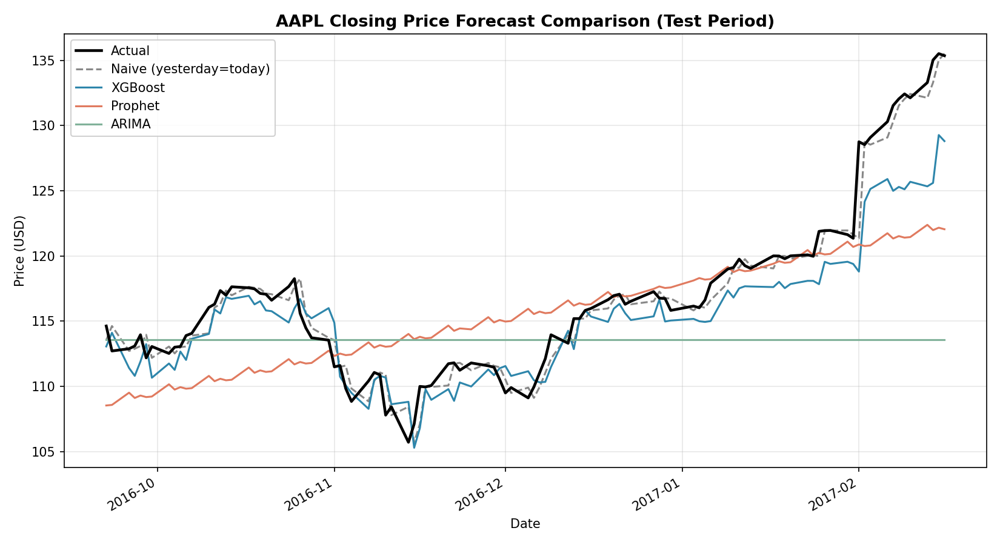
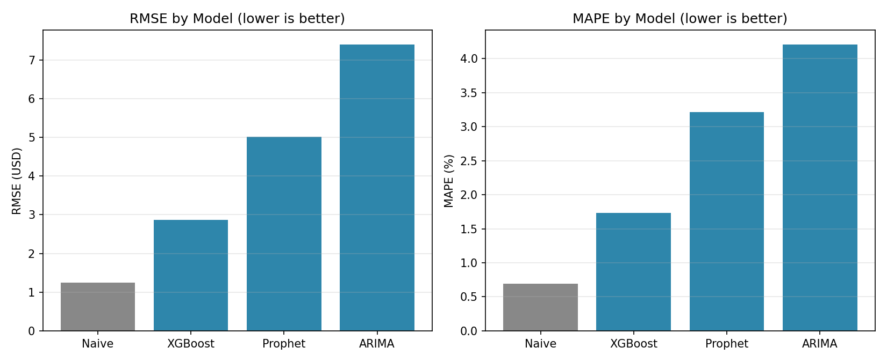

# Stock Price Forecasting: ARIMA vs. Prophet vs. XGBoost (vs. a Naive Baseline That Wins)

A comparison of three forecasting approaches — classical statistics
(ARIMA), structural time series (Prophet), and machine learning
(XGBoost with lag features) — on real daily AAPL closing prices. The
headline finding isn't which fancy model won. **None of them beat a
naive "tomorrow equals today" baseline**, and that result is the actual
point of this project.

## About the data

Unlike most other projects in this portfolio, this one uses **real,
directly downloaded data — no synthetic generation, no disclosure
needed.** Source: [`plotly/datasets`](https://github.com/plotly/datasets),
the official, MIT-licensed dataset repository maintained by Plotly Inc.,
file `finance-charts-apple.csv`. 506 trading days of real AAPL OHLCV
data, 2015-02-17 to 2017-02-16, verified directly against the source
file with zero missing values.

## Why this project is built the way it is

Most "time series forecasting" portfolio projects fit a model, report a
MAPE, and stop. That's an incomplete analysis, because **a MAPE number
means nothing without a baseline to compare it to.** This project
always evaluates every model against a naive random-walk baseline
(predict tomorrow = today), computed with the exact same metric
function as the sophisticated models — because if a fancy model can't
beat that trivial baseline, the fancy model has not demonstrated any
real predictive skill, no matter how good its raw MAPE looks in
isolation.

## Methodology

- **Train/test split**: chronological, 80/20 (404 train days / 102 test
  days) — **never random-shuffled**, since shuffling a time series
  before splitting leaks future information into the training set.
- **ARIMA**: order selected via `pmdarima.auto_arima` (AIC-based), not
  manually eyeballed from ACF/PACF plots.
- **Prophet**: weekly seasonality enabled, yearly/daily disabled (526
  days isn't enough for a yearly term to be meaningful).
- **XGBoost**: the time series is reframed as a supervised tabular
  problem — lag features (`lag_1` through `lag_10`), rolling mean/std
  (5/10/20-day windows), and day-of-week. All rolling features are
  computed on `shift(1)` data, i.e. strictly before the day being
  predicted — **no target leakage**.
- **Metrics**: MAE, RMSE, MAPE, computed identically for all four
  approaches (three models + the naive baseline) using one shared
  function.

## Results

| Model | MAE | RMSE | MAPE |
|---|---|---|---|
| **Naive** (yesterday = today) | **0.804** | **1.245** | **0.69%** |
| XGBoost | 2.099 | 2.869 | 1.74% |
| Prophet | 3.819 | 5.008 | 3.21% |
| ARIMA | 5.140 | 7.401 | 4.21% |





## The actual finding

**The naive baseline won by a wide margin.** This is not a failure of
implementation — it's the expected result for daily closing prices over
a short horizon, and it's worth understanding why each model lost the
way it did, since the *pattern* of failure is more informative than the
ranking:

- **`auto_arima` itself selected order (0,1,0)** — which is mathematically
  a pure random walk model. The statistical model-selection procedure
  independently arrived at "this series has no exploitable structure
  beyond yesterday's value," confirming the same conclusion the naive
  baseline represents, from inside a completely different framework.
- **XGBoost's dominant feature was `lag_1` at 69% importance** (checked
  directly via `model.feature_importances_`). XGBoost effectively
  *rediscovered the naive rule on its own*, but with enough added
  flexibility to slightly underperform the literal naive rule — for a
  near-random-walk series, the unconstrained naive prediction is closer
  to mathematically optimal than anything XGBoost's lag/rolling features
  could add on top of it.
- **Prophet's trend-extrapolation smoothing is the wrong tool for a
  series with this little autocorrelation structure** beyond lag-1 —
  confirmed by re-running it with all seasonality terms disabled
  (RMSE 5.045 vs. 5.008 with weekly seasonality on — essentially
  identical, so the seasonality term wasn't the problem; the
  trend-following approach itself is).

This is exactly what the efficient-market hypothesis predicts: short-
horizon daily closing prices are close to a random walk, and a
forecasting result that confirms this isn't a weak result — it's the
correct one. A project claiming "my model beats the market" without
this baseline check would be a *less* trustworthy piece of work than
this one, not a more impressive one.

## What this project demonstrates (skill-wise, separate from the finding)

- Implementing ARIMA, Prophet, and XGBoost-via-feature-engineering
  correctly, including the time-series-specific traps each one has
  (chronological splitting, no leakage in rolling features, AIC-based
  order selection instead of guessing)
- Knowing to check a naive baseline before trusting any forecasting
  metric in isolation
- Diagnosing *why* a model underperformed (feature importance, ARIMA
  order, an ablation on Prophet's seasonality) rather than just
  reporting numbers

## Repo structure

```
.
├── data/
│   └── aapl_raw.csv              # real AAPL data from plotly/datasets
├── scripts/
│   ├── prepare_data.py            # loading + lag/rolling feature engineering
│   ├── run_forecast_comparison.py # trains & evaluates all 3 models + baseline
│   └── make_chart.py              # generates the comparison charts
├── output/
│   ├── model_comparison_results.csv
│   ├── forecasts.csv
│   ├── forecast_comparison.png
│   └── metrics_comparison.png
└── requirements.txt
```

## How to run it

```bash
pip install -r requirements.txt
python scripts/run_forecast_comparison.py   # trains all models, prints + saves results
python scripts/make_chart.py                # generates the two PNG charts
```

## What I'd add with more time

- Forecasting returns (log differences) instead of raw price levels —
  returns are stationary and closer to what's actually tradeable;
  raw-price forecasting is the more common but less rigorous framing
- A longer test horizon broken into multiple folds (walk-forward
  validation) rather than one single 80/20 split, to check whether this
  conclusion holds across different market regimes
- GARCH for volatility forecasting, which is a genuinely different
  (and more tractable) problem than point-forecasting the price itself

## Tech stack

statsmodels · pmdarima · Prophet · XGBoost · scikit-learn · pandas ·
matplotlib
